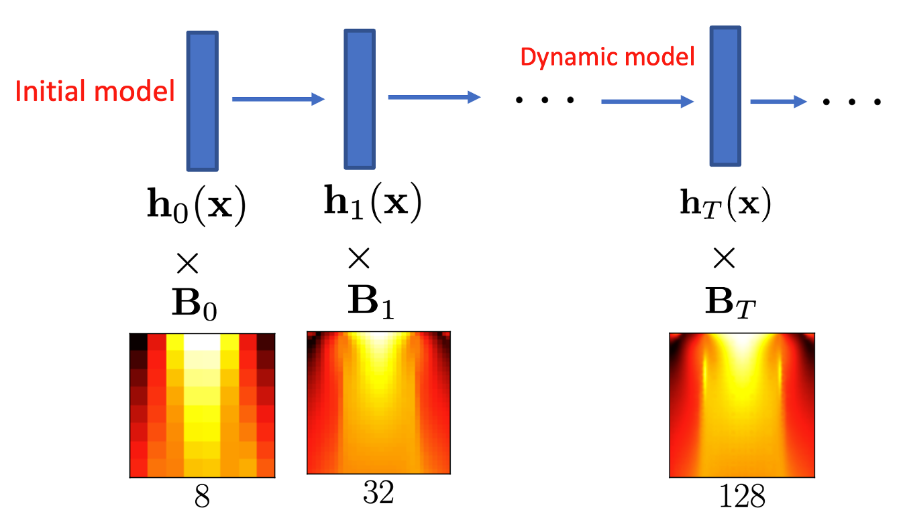
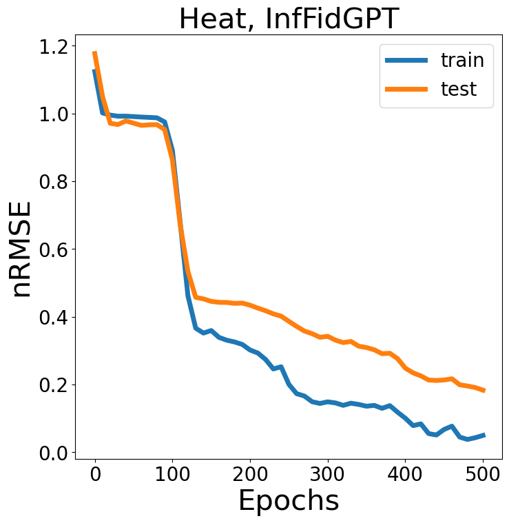
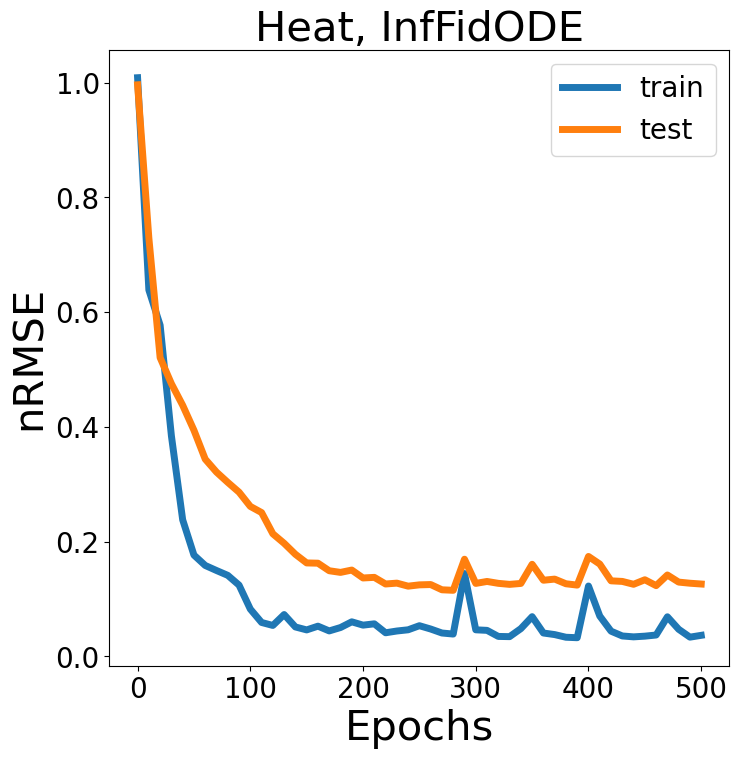

# *IFC*: Infinite-Fidelity Coregionalization for Physical Simulation

by [Shibo Li](https://imshibo.com), Wang Zheng, [Mike Kirby](https://www.cs.utah.edu/~kirby/) and [Shandian Zhe](https://www.cs.utah.edu/~zhe/)

<p align="center">
    <br>
    
    <br>
<p>

<h4 align="center">
    <p>
        <a href="https://openreview.net/forum?id=dUYLikScE-">Paper</a> |
        <a href="https://github.com/shib0li/Infinite-Fidelity-Coregionalization/blob/main/images/slides.pdf">Slides</a> |
        <a href="https://github.com/shib0li/Infinite-Fidelity-Coregionalization/blob/main/images/poster.pdf">Poster</a> 
    <p>
</h4>


Multi-fidelity modeling and learning is important in physical simulation related applications. It can leverage both low-fidelity and high-fidelity examples for training so as to reduce the cost of data generation yet still achieving good performance. While existing approaches only model finite, discrete fidelities, in practice, the feasible fidelity choice is often infinite, which can correspond to a continuous mesh spacing or finite element length.   In this paper, we propose Infinite Fidelity Coregionalization (IFC). Given the data, our method can extract and exploit rich information within infinite, continuous fidelities to bolster the prediction accuracy. Our model can interpolate and/or extrapolate the predictions to novel fidelities that are not covered by the training data. Specifically, we introduce a low-dimensional latent output as a continuous function of the fidelity and input, and multiple it with a basis matrix to predict high-dimensional solution outputs. We model the latent output as a neural Ordinary Differential Equation (ODE) to capture the complex relationships within and integrate information throughout the continuous fidelities.  We then use Gaussian processes or another ODE to estimate the fidelity-varying bases. For efficient inference, we reorganize the bases as a tensor, and use a tensor-Gaussian variational posterior approximation to develop a scalable inference algorithm for massive outputs. We show the advantage of our method in several benchmark tasks in computational physics. 

<!-- IFC-ODE $^2$ /GPT -->

# System Requirements

We highly recommend to use Docker to run our code. We have attached the docker build file `env.Dockerfile`. Or feel free to install the packages with pip/conda that could be found in the docker file.

# Datasets of Physical Simulations

*Heat* equation data is included in this repository. You can generate other physical simulations datasets by yourself by running

```
python generate.py -domain=(Heat, Poisson, Burgers, TopOpt, NavierStockPRec/URec/VRec)

```
For *Buergers*, *Topology Optimization*, *NavierStock*, the solvers requires MATLAB support. The generated multi-fidelity data will saved in to `data/__raw__` folder


```
data/
├── __raw__/
│   └── Heat_8_128/
│       └──...
├── matlab_solvers
```

# Run

To run *IFC-ODE* $^2$
```
bash test-ODE.sh $DOMAIN $RANK $EPOCHS $DEVICE $FOLD $INTERVAL $DEPTH_A

```
To run *IFC-GPT*
```
bash test-GPT.sh $DOMAIN $RANK $EPOCHS $DEVICE $FOLD $INTERVAL 

```

* `$DOMAIN` name of physical problesm: *Heat*, *Poisson*, *Burgers*, *TopOpt*, *NavierStockPRec*(3D problem)
* `$RANK` dimension of latent ODE
* `$EPOCHS` maximum epochs 
* `$DEVICE` where to run, for example ***cuda:0*** or ***cpu***
* `$FOLD` fold index of dataset
* `$INTERVAL` frequency for saving the results
* `$DEPTH_A` (for *IFC-ODE* $^2$ only) depth of basis neural ODE

# Example

You can fast test on *Heat* equation by run
```
bash test-ODE.sh/test-GPT.sh Heat 5 500 cuda:0 0 10
```
for 500 epochs, the training and testing errors are ploted

<p align="center">
    <br>
    
    <br>
<p>
    
<p align="center">
    <br>
    
    <br>
<p>


# License

IFC is released under the MIT License, please refer the LICENSE for details

# Getting Involved
Feel free to submit Github issues or pull requests. Welcome to contribute to our project!

To contact us, never hestitate to send an email to `shibo@cs.utah.edu` or `shiboli.cs@gmail.com` 
<br></br>


# Citation
Please cite our paper if you find it helpful :)

```

@inproceedings{
li2022infinitefidelity,
title={Infinite-Fidelity Coregionalization  for Physical Simulation},
author={Shibo Li and Zheng Wang and Robert Kirby and Shandian Zhe},
booktitle={Advances in Neural Information Processing Systems},
editor={Alice H. Oh and Alekh Agarwal and Danielle Belgrave and Kyunghyun Cho},
year={2022},
url={https://openreview.net/forum?id=dUYLikScE-}
}

```
<br></br>
